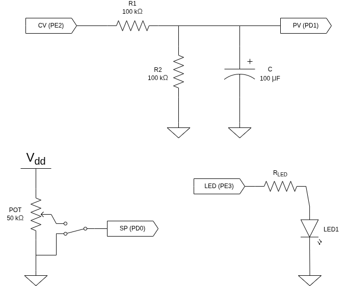

# Controle PID Digital – EFM32 Giant Gecko

Sistema de controle em malha fechada implementado em microcontrolador, utilizando PID discreto para controlar uma planta analógica de primeira ordem.

---

## Mapeamento de I/O

### Entradas Analógicas (ADC)

- **Referência (SP)** → PD0  
- **Variável de Processo (PV)** → PD1  

### Saída Analógica (PWM)

- **Variável de Controle (CV)** → PE2
  - Saída implementada via PWM (duty cycle proporcional ao sinal de controle)

### Saída Digital

- **Indicador de Regime Permanente** → PE3 (LED1)

---

## Arquitetura do Controlador

O controlador implementado é um **PID discreto paralelo**, contendo:

- Anti-windup condicional (integra apenas fora da saturação)
- Filtro de primeira ordem na ação derivativa
- Saturação explícita da saída
- Conversão tensão ↔ duty cycle (PWM)
- Detecção de regime permanente baseada no erro
- Máquina de estados determinística com ciclo fixo: **Leitura (ADC) → Processamento (PID) → Atualização das saídas (PWM/LED)**

A variável de controle é limitada entre `V_MIN` e `V_MAX`, sendo convertida proporcionalmente para o registrador do timer (PWM).

---

## Planta Controlada

A planta é um sistema RC equivalente de primeira ordem:

\[
\tau = (R_1 \parallel R_2)\, C = 5\,s
\]

\[
K = \frac{R_2}{R_1 + R_2} = 0{,}5
\]

Modelo dinâmico:

\[
G(s) = \frac{K}{\tau s + 1}
\]

A planta simula um processo físico real com dinâmica lenta.

---

## Sintonia do Controlador

Foi utilizada **Sintonia Lambda (Síntese Direta)** com:

\[
\lambda = 2\,s
\]

Ganhos obtidos:

\[
K_p = \frac{\tau}{K \lambda} = 5
\]

\[
K_i = \frac{1}{K \lambda} = 1
\]

Controlador implementado (PI):

\[
C(s) = K_p + \frac{K_i}{s}
\]

A ação derivativa está implementada no firmware, porém não foi utilizada na sintonia final.

---

## Características gerais do sistema

- Controle digital embarcado
- Planta analógica real
- Malha fechada contínua
- Conversão ADC para tensão física
- PWM proporcional para acionamento
- Detecção automática de regime permanente
- Anti-windup para evitar saturação do integrador
- Filtro na derivada para redução de ruído
